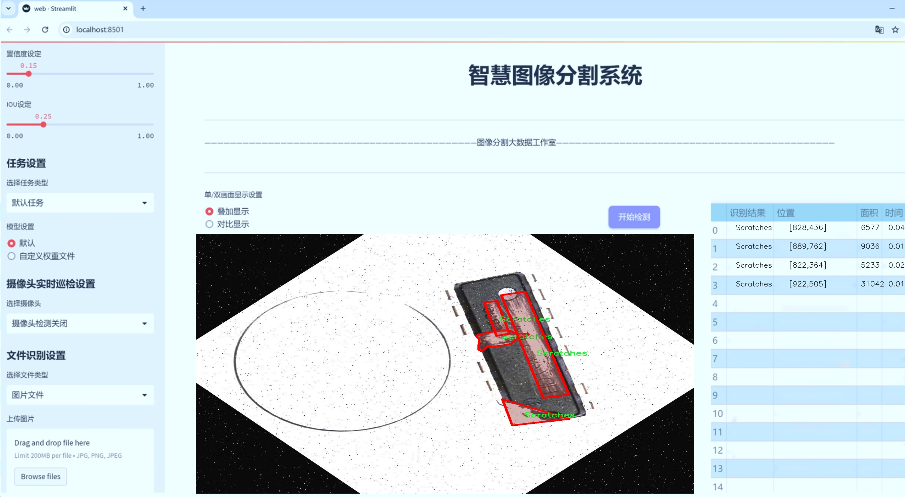
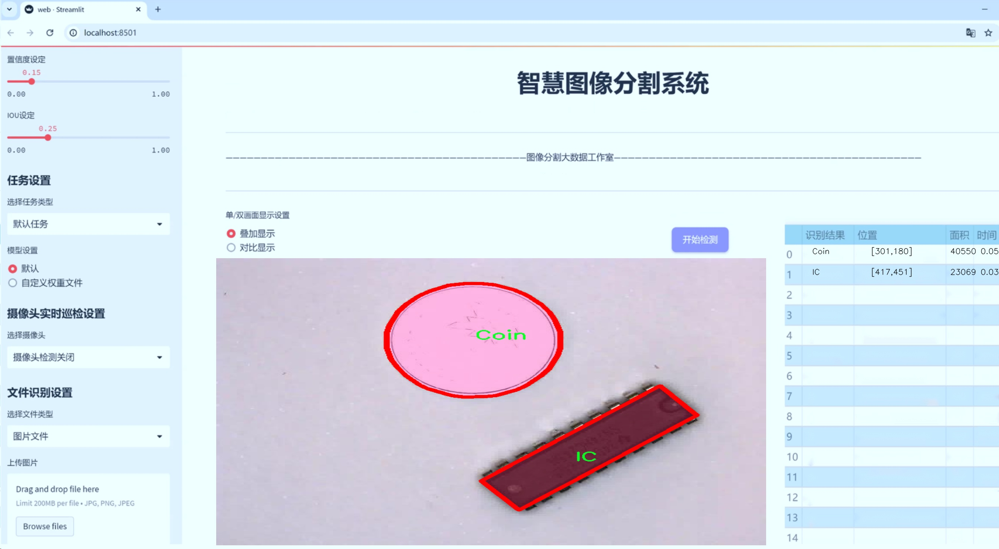
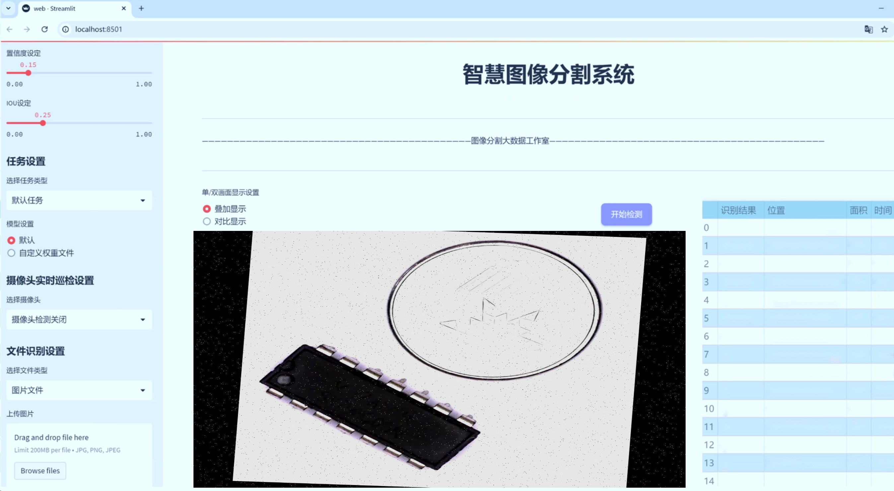
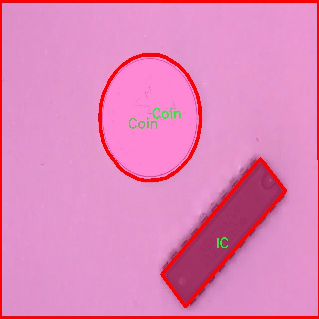
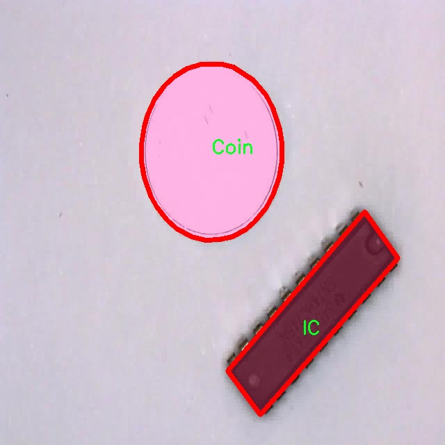
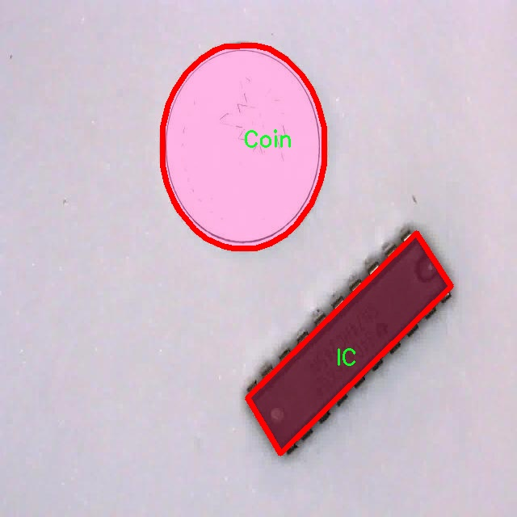
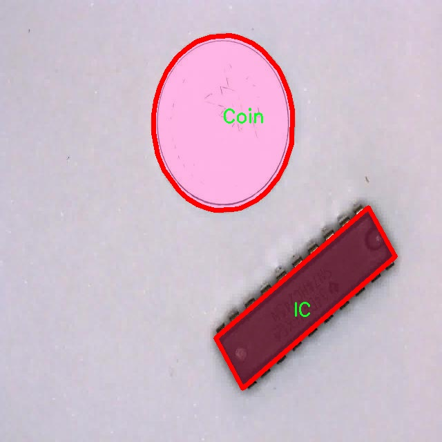

# 电子元件缺陷分割系统源码＆数据集分享
 [yolov8-seg-efficientViT＆yolov8-seg-C2f-ODConv等50+全套改进创新点发刊_一键训练教程_Web前端展示]

### 1.研究背景与意义

项目参考[ILSVRC ImageNet Large Scale Visual Recognition Challenge](https://gitee.com/YOLOv8_YOLOv11_Segmentation_Studio/projects)

项目来源[AAAI Global Al lnnovation Contest](https://kdocs.cn/l/cszuIiCKVNis)

研究背景与意义

随着电子技术的迅猛发展，电子元件的广泛应用使得其生产和质量控制变得愈发重要。电子元件的缺陷不仅会影响产品的性能和可靠性，还可能导致严重的经济损失和安全隐患。因此，及时、准确地检测和分割电子元件中的缺陷，成为了电子制造行业亟待解决的关键问题。传统的缺陷检测方法多依赖人工目视检查和简单的图像处理技术，效率低下且容易受到人为因素的影响，难以满足现代生产的高效性和准确性要求。

近年来，深度学习技术的迅猛发展为缺陷检测提供了新的解决方案。尤其是基于卷积神经网络（CNN）的目标检测和分割模型，如YOLO（You Only Look Once）系列，因其高效的实时处理能力和优越的检测精度，逐渐成为工业视觉检测领域的研究热点。YOLOv8作为该系列的最新版本，结合了更先进的网络结构和训练策略，展现出更强的特征提取能力和更快的推理速度，适合用于复杂场景下的缺陷检测任务。

本研究旨在基于改进的YOLOv8模型，构建一个针对电子元件缺陷的分割系统。我们将利用一个包含3300张图像的数据集，该数据集涵盖了10个类别的电子元件缺陷，包括弯曲的腿、主体、硬币、集成电路（IC）、IC形状、腿、引脚、划痕、不可读和不需要的缺陷。这些类别的多样性使得模型能够在不同的缺陷类型上进行有效的学习和识别，从而提高系统的通用性和适应性。

在此背景下，改进YOLOv8模型的研究意义主要体现在以下几个方面：首先，通过深度学习技术的引入，能够大幅提高电子元件缺陷检测的自动化水平，减少人工干预，提高生产效率。其次，基于实例分割的技术，能够实现对缺陷的精确定位和分类，为后续的质量控制和缺陷分析提供可靠的数据支持。此外，改进的YOLOv8模型将通过优化网络结构和训练策略，提升检测精度，降低误检率，从而增强系统的实用性和可靠性。

最后，随着电子元件制造技术的不断进步，未来将面临更加复杂的缺陷检测挑战。本研究所构建的电子元件缺陷分割系统，不仅为当前的工业应用提供了有效的解决方案，也为后续相关研究提供了理论基础和实践经验。通过不断优化和迭代，该系统有望在更广泛的应用场景中发挥重要作用，推动电子制造行业的智能化发展。因此，本研究不仅具有重要的学术价值，也具有显著的实际应用意义。

### 2.图片演示







##### 注意：由于此博客编辑较早，上面“2.图片演示”和“3.视频演示”展示的系统图片或者视频可能为老版本，新版本在老版本的基础上升级如下：（实际效果以升级的新版本为准）

  （1）适配了YOLOV8的“目标检测”模型和“实例分割”模型，通过加载相应的权重（.pt）文件即可自适应加载模型。

  （2）支持“图片识别”、“视频识别”、“摄像头实时识别”三种识别模式。

  （3）支持“图片识别”、“视频识别”、“摄像头实时识别”三种识别结果保存导出，解决手动导出（容易卡顿出现爆内存）存在的问题，识别完自动保存结果并导出到tempDir中。

  （4）支持Web前端系统中的标题、背景图等自定义修改，后面提供修改教程。

  另外本项目提供训练的数据集和训练教程,暂不提供权重文件（best.pt）,需要您按照教程进行训练后实现图片演示和Web前端界面演示的效果。

### 3.视频演示

[3.1 视频演示](https://www.bilibili.com/video/BV1jyC2YrE76/)

### 4.数据集信息展示

##### 4.1 本项目数据集详细数据（类别数＆类别名）

nc: 10
names: ['Bent_Legs', 'Body', 'Coin', 'IC', 'IC_Shape', 'Legs', 'Pin', 'Scratches', 'Unreadable', 'Unwanted']


##### 4.2 本项目数据集信息介绍

数据集信息展示

在现代电子制造业中，电子元件的质量控制至关重要。为了提升缺陷检测的效率和准确性，我们构建了一个专门用于训练改进YOLOv8-seg的电子元件缺陷分割系统的数据集，命名为“peepeepoopoo”。该数据集旨在为研究人员和工程师提供一个丰富的基础，以便在深度学习框架下进行电子元件缺陷的自动检测与分割。数据集包含了10个类别，涵盖了电子元件在生产和使用过程中可能出现的各种缺陷，这些类别分别是：Bent_Legs（弯曲的腿）、Body（主体）、Coin（焊点）、IC（集成电路）、IC_Shape（集成电路形状）、Legs（腿部）、Pin（引脚）、Scratches（划痕）、Unreadable（不可读）、Unwanted（不需要的缺陷）。

在数据集的构建过程中，我们特别注重数据的多样性和代表性。每个类别的样本均来自于真实的生产环境，确保了数据集的实际应用价值。例如，Bent_Legs类别的样本展示了由于机械故障或操作不当导致的元件腿部弯曲现象，这种缺陷可能会影响元件的稳定性和性能。Body类别则涵盖了电子元件主体的各种外观问题，包括表面缺陷和结构损伤。Coin类别专注于焊点的质量，焊点的缺陷可能会导致电气连接不良，从而影响整个电路的功能。

在IC和IC_Shape类别中，我们收录了多种集成电路的样本，这些样本不仅包括正常的IC形状，还包括由于制造缺陷导致的形状异常。这些数据对于训练模型识别和分割IC的形状至关重要，能够帮助工程师快速定位问题。Legs和Pin类别则关注元件的腿部和引脚，这些部分在焊接过程中容易出现缺陷，影响元件的可靠性。

此外，Scratches类别的样本展示了元件表面划痕的情况，这些划痕可能会导致元件在使用过程中的性能下降。Unreadable类别则包括了因印刷不清晰或损坏而导致的不可读信息，这在电子元件的追溯和识别中是一个重要问题。最后，Unwanted类别则涵盖了那些不必要的缺陷，如多余的焊料或杂质，这些缺陷在生产过程中可能会被忽视，但对产品质量有着潜在的影响。

通过对“peepeepoopoo”数据集的深入分析和应用，我们期望能够训练出更为精准的YOLOv8-seg模型，从而在电子元件的缺陷检测和分割任务中取得显著的进展。该数据集不仅为学术研究提供了宝贵的资源，也为实际生产中的质量控制提供了强有力的支持。随着深度学习技术的不断发展，我们相信该数据集将成为电子元件缺陷检测领域的重要基石，推动行业的技术进步与创新。










### 5.全套项目环境部署视频教程（零基础手把手教学）

[5.1 环境部署教程链接（零基础手把手教学）](https://www.bilibili.com/video/BV1jG4Ve4E9t/?vd_source=bc9aec86d164b67a7004b996143742dc)


[5.2 安装Python虚拟环境创建和依赖库安装视频教程链接（零基础手把手教学）](https://www.bilibili.com/video/BV1nA4VeYEze/?vd_source=bc9aec86d164b67a7004b996143742dc)

### 6.手把手YOLOV8-seg训练视频教程（零基础小白有手就能学会）

[6.1 手把手YOLOV8-seg训练视频教程（零基础小白有手就能学会）](https://www.bilibili.com/video/BV1cA4VeYETe/?vd_source=bc9aec86d164b67a7004b996143742dc)


按照上面的训练视频教程链接加载项目提供的数据集，运行train.py即可开始训练



     Epoch   gpu_mem       box       obj       cls    labels  img_size
     1/200     0G   0.01576   0.01955  0.007536        22      1280: 100%|██████████| 849/849 [14:42<00:00,  1.04s/it]
               Class     Images     Labels          P          R     mAP@.5 mAP@.5:.95: 100%|██████████| 213/213 [01:14<00:00,  2.87it/s]
                 all       3395      17314      0.994      0.957      0.0957      0.0843

     Epoch   gpu_mem       box       obj       cls    labels  img_size
     2/200     0G   0.01578   0.01923  0.007006        22      1280: 100%|██████████| 849/849 [14:44<00:00,  1.04s/it]
               Class     Images     Labels          P          R     mAP@.5 mAP@.5:.95: 100%|██████████| 213/213 [01:12<00:00,  2.95it/s]
                 all       3395      17314      0.996      0.956      0.0957      0.0845

     Epoch   gpu_mem       box       obj       cls    labels  img_size
     3/200     0G   0.01561    0.0191  0.006895        27      1280: 100%|██████████| 849/849 [10:56<00:00,  1.29it/s]
               Class     Images     Labels          P          R     mAP@.5 mAP@.5:.95: 100%|███████   | 187/213 [00:52<00:00,  4.04it/s]
                 all       3395      17314      0.996      0.957      0.0957      0.0845


### 7.50+种全套YOLOV8-seg创新点代码加载调参视频教程（一键加载写好的改进模型的配置文件）

[7.1 50+种全套YOLOV8-seg创新点代码加载调参视频教程（一键加载写好的改进模型的配置文件）](https://www.bilibili.com/video/BV1Hw4VePEXv/?vd_source=bc9aec86d164b67a7004b996143742dc)

### 8.YOLOV8-seg图像分割算法原理

原始YOLOV8-seg算法原理

YOLOv8-seg算法是YOLO系列的最新版本，专门针对目标检测和实例分割任务进行了优化。自2023年1月发布以来，YOLOv8-seg凭借其卓越的性能和高效的计算能力，迅速成为计算机视觉领域的佼佼者。该算法在YOLOv5、YOLOv6和YOLOv7的基础上进行了多项创新，旨在提升模型的准确性和速度，同时保持工程化的简洁性。

YOLOv8-seg的网络结构由三个主要部分组成：输入端、主干网络和检测端。输入端负责接收原始图像数据，并进行必要的预处理。主干网络则是YOLOv8-seg的核心，采用了更深的卷积神经网络结构，能够提取图像中的丰富特征信息。检测端则负责对提取的特征进行分析，以实现目标的分类和定位。

在YOLOv8-seg中，主干网络采用了PAN-FPN（路径聚合网络-特征金字塔网络）结构，旨在增强特征融合的能力。与以往的YOLO版本相比，YOLOv8-seg在PAN-FPN结构上进行了创新，去除了上采样部分的卷积结构，并引入了新的C2f模块。C2f模块结合了C3模块和ELAN模块的思想，增加了更多的残差连接，从而在保持轻量化的同时，获得了更丰富的梯度信息。这种设计使得YOLOv8-seg在处理复杂场景时，能够更好地捕捉到目标的细节特征。

YOLOv8-seg的检测端则采用了流行的解耦合头结构，将分类和检测任务分开处理。这一设计的优势在于可以更灵活地优化每个任务的性能，尤其是在面对多类别目标时，能够有效减少类别间的干扰。此外，YOLOv8-seg摒弃了传统的Anchor-Based方法，转而采用Anchor-Free策略，简化了模型的设计，同时提高了检测的准确性。

在训练过程中，YOLOv8-seg采用了动态的样本分配策略和数据增强技术，以提升模型的泛化能力。具体而言，在训练的最后10个epoch中，关闭了马赛克增强，并引入了Task-Aligned Assigner策略。这种策略能够根据任务的需求动态调整样本的分配，从而更有效地利用训练数据，提升模型的学习效率。

损失函数的设计也是YOLOv8-seg的一大亮点。算法采用了BCELoss作为分类损失，同时结合DFLLoss和CIoULoss作为回归损失。这种多损失函数的组合，能够更全面地评估模型的性能，使得YOLOv8-seg在分类和定位任务上均表现出色。

YOLOv8-seg的设计理念不仅关注于模型的准确性和速度，还强调了在各种硬件平台上的适应性。无论是在CPU还是GPU上，YOLOv8-seg都能够高效运行，满足不同应用场景的需求。这种灵活性使得YOLOv8-seg在智能监控、自动驾驶、医疗影像分析等多个领域得到了广泛应用。

在具体的实现上，YOLOv8-seg通过多尺度训练和测试技术，进一步提升了模型的性能。该算法能够在不同尺度的图像上进行训练，从而增强模型对小目标的检测能力。此外，YOLOv8-seg还支持高分辨率图像的处理，确保在复杂场景下的目标检测和分割任务能够高效完成。

通过对YOLOv8-seg的深入分析，可以看出其在目标检测和实例分割领域的广泛应用潜力。随着技术的不断进步，YOLOv8-seg不仅在精度和速度上超越了前代模型，还为未来的研究和应用提供了新的思路和方向。其在设计上的创新，尤其是在主干网络和检测头的结构优化，使得YOLOv8-seg在面对复杂的视觉任务时，能够展现出更强的适应性和鲁棒性。

总之，YOLOv8-seg算法以其独特的结构设计和创新的技术手段，成功地将目标检测与实例分割任务结合在一起，成为计算机视觉领域的重要工具。随着对YOLOv8-seg的进一步研究和应用，其在各类实际场景中的表现将不断得到验证和提升，推动计算机视觉技术的持续发展。


### 9.系统功能展示（检测对象为举例，实际内容以本项目数据集为准）

图9.1.系统支持检测结果表格显示

  图9.2.系统支持置信度和IOU阈值手动调节

  图9.3.系统支持自定义加载权重文件best.pt(需要你通过步骤5中训练获得)

  图9.4.系统支持摄像头实时识别

  图9.5.系统支持图片识别

  图9.6.系统支持视频识别

  图9.7.系统支持识别结果文件自动保存

  图9.8.系统支持Excel导出检测结果数据


### 10.50+种全套YOLOV8-seg创新点原理讲解（非科班也可以轻松写刊发刊，V11版本正在科研待更新）

#### 10.1 由于篇幅限制，每个创新点的具体原理讲解就不一一展开，具体见下列网址中的创新点对应子项目的技术原理博客网址【Blog】：


[10.1 50+种全套YOLOV8-seg创新点原理讲解链接](https://gitee.com/qunmasj/good)

#### 10.2 部分改进模块原理讲解(完整的改进原理见上图和技术博客链接)【如果此小节的图加载失败可以通过CSDN或者Github搜索该博客的标题访问原始博客，原始博客图片显示正常】

### YOLOv8简介

按照官方描述，YOLOv8 是一个 SOTA 模型，它建立在以前 YOLO 版本的成功基础上，并引入了新的功能和改进，以进一步提升性能和灵活性。具体创新包括一个新的骨干网络、一个新的 Ancher-Free 检测头和一个新的损失函数，可以在从 CPU 到 GPU 的各种硬件平台上运行。

不过 ultralytics 并没有直接将开源库命名为 YOLOv8，而是直接使用 ultralytics 这个词，原因是 ultralytics 将这个库定位为算法框架，而非某一个特定算法，一个主要特点是可扩展性。其希望这个库不仅仅能够用于 YOLO 系列模型，而是能够支持非 YOLO 模型以及分类分割姿态估计等各类任务。
总而言之，ultralytics 开源库的两个主要优点是：

融合众多当前 SOTA 技术于一体
未来将支持其他 YOLO 系列以及 YOLO 之外的更多算法


下表为官方在 COCO Val 2017 数据集上测试的 mAP、参数量和 FLOPs 结果。可以看出 YOLOv8 相比 YOLOv5 精度提升非常多，但是 N/S/M 模型相应的参数量和 FLOPs 都增加了不少，从上图也可以看出相比 YOLOV5 大部分模型推理速度变慢了。


额外提一句，现在各个 YOLO 系列改进算法都在 COCO 上面有明显性能提升，但是在自定义数据集上面的泛化性还没有得到广泛验证，至今依然听到不少关于 YOLOv5 泛化性能较优异的说法。对各系列 YOLO 泛化性验证也是 MMYOLO 中一个特别关心和重点发力的方向。

### YOLO-MS简介
实时目标检测，以YOLO系列为例，已在工业领域中找到重要应用，特别是在边缘设备（如无人机和机器人）中。与之前的目标检测器不同，实时目标检测器旨在在速度和准确性之间追求最佳平衡。为了实现这一目标，提出了大量的工作：从第一代DarkNet到CSPNet，再到最近的扩展ELAN，随着性能的快速增长，实时目标检测器的架构经历了巨大的变化。

尽管性能令人印象深刻，但在不同尺度上识别对象仍然是实时目标检测器面临的基本挑战。这促使作者设计了一个强大的编码器架构，用于学习具有表现力的多尺度特征表示。具体而言，作者从两个新的角度考虑为实时目标检测编码多尺度特征：

从局部视角出发，作者设计了一个具有简单而有效的分层特征融合策略的MS-Block。受到Res2Net的启发，作者在MS-Block中引入了多个分支来进行特征提取，但不同的是，作者使用了一个带有深度卷积的 Inverted Bottleneck Block块，以实现对大Kernel的高效利用。

从全局视角出发，作者提出随着网络加深逐渐增加卷积的Kernel-Size。作者在浅层使用小Kernel卷积来更高效地处理高分辨率特征。另一方面，在深层中，作者采用大Kernel卷积来捕捉广泛的信息。

基于以上设计原则，作者呈现了作者的实时目标检测器，称为YOLO-MS。为了评估作者的YOLO-MS的性能，作者在MS COCO数据集上进行了全面的实验。还提供了与其他最先进方法的定量比较，以展示作者方法的强大性能。如图1所示，YOLO-MS在计算性能平衡方面优于其他近期的实时目标检测器。


具体而言，YOLO-MS-XS在MS COCO上获得了43%+的AP得分，仅具有450万个可学习参数和8.7亿个FLOPs。YOLO-MS-S和YOLO-MS分别获得了46%+和51%+的AP，可学习参数分别为810万和2220万。此外，作者的工作还可以作为其他YOLO模型的即插即用模块。通常情况下，作者的方法可以将YOLOv8的AP从37%+显著提高到40%+，甚至还可以使用更少的参数和FLOPs。


#### Multi-Scale Building Block Design
CSP Block是一个基于阶段级梯度路径的网络，平衡了梯度组合和计算成本。它是广泛应用于YOLO系列的基本构建块。已经提出了几种变体，包括YOLOv4和YOLOv5中的原始版本，Scaled YOLOv4中的CSPVoVNet，YOLOv7中的ELAN，以及RTMDet中提出的大Kernel单元。作者在图2(a)和图2(b)中分别展示了原始CSP块和ELAN的结构。


上述实时检测器中被忽视的一个关键方面是如何在基本构建块中编码多尺度特征。其中一个强大的设计原则是Res2Net，它聚合了来自不同层次的特征以增强多尺度表示。然而，这一原则并没有充分探索大Kernel卷积的作用，而大Kernel卷积已经在基于CNN的视觉识别任务模型中证明有效。将大Kernel卷积纳入Res2Net的主要障碍在于它们引入的计算开销，因为构建块采用了标准卷积。在作者的方法中，作者提出用 Inverted Bottleneck Block替代标准的3 × 3卷积，以享受大Kernel卷积的好处。

基于前面的分析，作者提出了一个带有分层特征融合策略的全新Block，称为MS-Block，以增强实时目标检测器在提取多尺度特征时的能力，同时保持快速的推理速度。

MS-Block的具体结构如图2(c)所示。假设是输入特征。通过1×1卷积的转换后，X的通道维度增加到n*C。然后，作者将X分割成n个不同的组，表示为，其中。为了降低计算成本，作者选择n为3。

注意，除了之外，每个其他组都经过一个 Inverted Bottleneck Block层，用表示，其中k表示Kernel-Size，以获得。的数学表示如下：


根据这个公式，该博客的作者不将 Inverted Bottleneck Block层连接，使其作为跨阶段连接，并保留来自前面层的信息。最后，作者将所有分割连接在一起，并应用1×1卷积来在所有分割之间进行交互，每个分割都编码不同尺度的特征。当网络加深时，这个1×1卷积也用于调整通道数。

#### Heterogeneous Kernel Selection Protocol
除了构建块的设计外，作者还从宏观角度探讨了卷积的使用。之前的实时目标检测器在不同的编码器阶段采用了同质卷积（即具有相同Kernel-Size的卷积），但作者认为这不是提取多尺度语义信息的最佳选项。

在金字塔结构中，从检测器的浅阶段提取的高分辨率特征通常用于捕捉细粒度语义，将用于检测小目标。相反，来自网络较深阶段的低分辨率特征用于捕捉高级语义，将用于检测大目标。如果作者在所有阶段都采用统一的小Kernel卷积，深阶段的有效感受野（ERF）将受到限制，影响大目标的性能。在每个阶段中引入大Kernel卷积可以帮助解决这个问题。然而，具有大的ERF的大Kernel可以编码更广泛的区域，这增加了在小目标外部包含噪声信息的概率，并且降低了推理速度。

在这项工作中，作者建议在不同阶段中采用异构卷积，以帮助捕获更丰富的多尺度特征。具体来说，在编码器的第一个阶段中，作者采用最小Kernel卷积，而最大Kernel卷积位于最后一个阶段。随后，作者逐步增加中间阶段的Kernel-Size，使其与特征分辨率的增加保持一致。这种策略允许提取细粒度和粗粒度的语义信息，增强了编码器的多尺度特征表示能力。

正如图所示，作者将k的值分别分配给编码器中的浅阶段到深阶段，取值为3、5、7和9。作者将其称为异构Kernel选择（HKS）协议。


作者的HKS协议能够在深层中扩大感受野，而不会对浅层产生任何其他影响。此外，HKS不仅有助于编码更丰富的多尺度特征，还确保了高效的推理。

如表1所示，将大Kernel卷积应用于高分辨率特征会产生较高的计算开销。然而，作者的HKS协议在低分辨率特征上采用大Kernel卷积，从而与仅使用大Kernel卷积相比，大大降低了计算成本。


在实践中，作者经验性地发现，采用HKS协议的YOLO-MS的推理速度几乎与仅使用深度可分离的3 × 3卷积相同。

#### Architecture
如图所示，作者模型的Backbone由4个阶段组成，每个阶段后面跟随1个步长为2的3 × 3卷积进行下采样。在第3个阶段后，作者添加了1个SPP块，与RTMDet中一样。在作者的编码器上，作者使用PAFPN作为Neck来构建特征金字塔[31, 35]。它融合了从Backbone不同阶段提取的多尺度特征。Neck中使用的基本构建块也是作者的MS-Block，在其中使用3 × 3深度可分离卷积进行快速推理。

此外，为了在速度和准确性之间取得更好的平衡，作者将Backbone中多级特征的通道深度减半。作者提供了3个不同尺度的YOLO-MS变体，即YOLO-MS-XS、YOLO-MS-S和YOLO-MS。不同尺度的YOLO-MS的详细配置列在表2中。对于YOLO-MS的其他部分，作者将其保持与RTMDet相同。


### 11.项目核心源码讲解（再也不用担心看不懂代码逻辑）

#### 11.1 ultralytics\utils\callbacks\__init__.py

下面是对提供的代码进行逐行分析，并保留核心部分的结果，同时添加详细的中文注释：

```python
# Ultralytics YOLO 🚀, AGPL-3.0 license

# 从当前包的 base 模块导入三个函数：add_integration_callbacks、default_callbacks 和 get_default_callbacks
from .base import add_integration_callbacks, default_callbacks, get_default_callbacks

# 定义当前模块的公开接口，指定可以被外部访问的名称
__all__ = 'add_integration_callbacks', 'default_callbacks', 'get_default_callbacks'
```

### 代码分析与注释

1. **模块说明**：
   - `# Ultralytics YOLO 🚀, AGPL-3.0 license`：这行注释说明了该代码属于 Ultralytics YOLO 项目，并且遵循 AGPL-3.0 许可证。

2. **导入语句**：
   - `from .base import add_integration_callbacks, default_callbacks, get_default_callbacks`：
     - 这一行代码从当前包的 `base` 模块中导入了三个函数。
     - `add_integration_callbacks`：可能用于添加集成回调的功能。
     - `default_callbacks`：可能是一些默认的回调函数或设置。
     - `get_default_callbacks`：可能用于获取默认的回调函数。

3. **公开接口定义**：
   - `__all__ = 'add_integration_callbacks', 'default_callbacks', 'get_default_callbacks'`：
     - 这行代码定义了模块的公开接口，指定了在使用 `from module import *` 时可以导入的名称。
     - 通过定义 `__all__`，可以控制哪些对象可以被外部访问，增强模块的封装性。

### 核心部分总结
这段代码的核心在于导入了必要的回调函数，并通过 `__all__` 定义了模块的公开接口，确保其他模块在使用时只访问到指定的功能。

这个文件是Ultralytics YOLO项目中的一个初始化文件，位于`ultralytics/utils/callbacks`目录下。它的主要作用是导入和组织回调函数相关的功能。

首先，文件开头的注释部分表明了该项目的名称（Ultralytics YOLO）以及其使用的许可证类型（AGPL-3.0）。这说明该项目是开源的，并且遵循特定的开源协议。

接下来，文件通过`from .base import ...`语句从同一目录下的`base`模块中导入了三个函数：`add_integration_callbacks`、`default_callbacks`和`get_default_callbacks`。这些函数可能与回调机制有关，回调机制通常用于在特定事件发生时执行特定的代码，常见于训练过程中的监控和日志记录等功能。

最后，`__all__`变量定义了当使用`from module import *`语句时，哪些名称会被导入。这里定义的名称包括`add_integration_callbacks`、`default_callbacks`和`get_default_callbacks`，这意味着这三个函数是该模块的公共接口，用户可以直接使用它们。

总的来说，这个文件的主要功能是将回调相关的功能集中在一起，方便其他模块或用户进行调用和使用。

#### 11.2 ultralytics\trackers\utils\gmc.py

以下是代码中最核心的部分，并附上详细的中文注释：

```python
import cv2
import numpy as np

class GMC:
    """
    一般化运动补偿 (GMC) 类，用于视频帧中的跟踪和物体检测。
    """

    def __init__(self, method='sparseOptFlow', downscale=2):
        """初始化视频跟踪器，指定跟踪方法和缩放因子。"""
        self.method = method  # 设置跟踪方法
        self.downscale = max(1, int(downscale))  # 设置缩放因子，确保至少为1

        # 根据选择的跟踪方法初始化检测器、提取器和匹配器
        if self.method == 'orb':
            self.detector = cv2.FastFeatureDetector_create(20)
            self.extractor = cv2.ORB_create()
            self.matcher = cv2.BFMatcher(cv2.NORM_HAMMING)
        elif self.method == 'sift':
            self.detector = cv2.SIFT_create(nOctaveLayers=3, contrastThreshold=0.02, edgeThreshold=20)
            self.extractor = cv2.SIFT_create(nOctaveLayers=3, contrastThreshold=0.02, edgeThreshold=20)
            self.matcher = cv2.BFMatcher(cv2.NORM_L2)
        elif self.method == 'ecc':
            self.warp_mode = cv2.MOTION_EUCLIDEAN  # 设置变换模式
            self.criteria = (cv2.TERM_CRITERIA_EPS | cv2.TERM_CRITERIA_COUNT, 5000, 1e-6)  # 设置终止条件
        elif self.method == 'sparseOptFlow':
            self.feature_params = dict(maxCorners=1000, qualityLevel=0.01, minDistance=1, blockSize=3)
        elif self.method in ['none', 'None', None]:
            self.method = None
        else:
            raise ValueError(f'Error: Unknown GMC method:{method}')  # 抛出未知方法错误

        # 初始化变量
        self.prevFrame = None  # 存储前一帧
        self.prevKeyPoints = None  # 存储前一帧的关键点
        self.prevDescriptors = None  # 存储前一帧的描述符
        self.initializedFirstFrame = False  # 标记是否已处理第一帧

    def apply(self, raw_frame, detections=None):
        """根据指定的方法对原始帧应用物体检测。"""
        if self.method in ['orb', 'sift']:
            return self.applyFeatures(raw_frame, detections)  # 应用特征检测
        elif self.method == 'ecc':
            return self.applyEcc(raw_frame, detections)  # 应用ECC算法
        elif self.method == 'sparseOptFlow':
            return self.applySparseOptFlow(raw_frame, detections)  # 应用稀疏光流法
        else:
            return np.eye(2, 3)  # 返回单位矩阵

    def applyEcc(self, raw_frame, detections=None):
        """应用ECC算法进行运动补偿。"""
        height, width, _ = raw_frame.shape  # 获取帧的高度和宽度
        frame = cv2.cvtColor(raw_frame, cv2.COLOR_BGR2GRAY)  # 将帧转换为灰度图
        H = np.eye(2, 3, dtype=np.float32)  # 初始化变换矩阵

        # 根据缩放因子对图像进行缩放
        if self.downscale > 1.0:
            frame = cv2.resize(frame, (width // self.downscale, height // self.downscale))

        # 处理第一帧
        if not self.initializedFirstFrame:
            self.prevFrame = frame.copy()  # 复制当前帧作为前一帧
            self.initializedFirstFrame = True  # 标记为已初始化
            return H

        # 运行ECC算法，结果存储在H中
        try:
            (cc, H) = cv2.findTransformECC(self.prevFrame, frame, H, self.warp_mode, self.criteria, None, 1)
        except Exception as e:
            LOGGER.warning(f'WARNING: find transform failed. Set warp as identity {e}')  # 记录警告

        return H

    def applyFeatures(self, raw_frame, detections=None):
        """应用特征检测方法进行运动补偿。"""
        height, width, _ = raw_frame.shape  # 获取帧的高度和宽度
        frame = cv2.cvtColor(raw_frame, cv2.COLOR_BGR2GRAY)  # 将帧转换为灰度图
        H = np.eye(2, 3)  # 初始化变换矩阵

        # 根据缩放因子对图像进行缩放
        if self.downscale > 1.0:
            frame = cv2.resize(frame, (width // self.downscale, height // self.downscale))

        # 查找关键点
        keypoints = self.detector.detect(frame, None)  # 检测关键点

        # 处理第一帧
        if not self.initializedFirstFrame:
            self.prevFrame = frame.copy()  # 复制当前帧作为前一帧
            self.prevKeyPoints = copy.copy(keypoints)  # 复制关键点
            self.prevDescriptors = None  # 描述符暂时不使用
            self.initializedFirstFrame = True  # 标记为已初始化
            return H

        # 计算描述符
        keypoints, descriptors = self.extractor.compute(frame, keypoints)

        # 匹配描述符
        knnMatches = self.matcher.knnMatch(self.prevDescriptors, descriptors, 2)  # KNN匹配

        # 过滤匹配
        matches = []
        for m, n in knnMatches:
            if m.distance < 0.9 * n.distance:  # 过滤掉较差的匹配
                matches.append(m)

        # 计算变换矩阵
        if len(matches) > 4:  # 至少需要5个匹配点
            prevPoints = np.array([self.prevKeyPoints[m.queryIdx].pt for m in matches])
            currPoints = np.array([keypoints[m.trainIdx].pt for m in matches])
            H, _ = cv2.estimateAffinePartial2D(prevPoints, currPoints, cv2.RANSAC)  # 估计变换矩阵
        else:
            LOGGER.warning('WARNING: not enough matching points')  # 记录警告

        # 更新前一帧和关键点
        self.prevFrame = frame.copy()
        self.prevKeyPoints = copy.copy(keypoints)
        self.prevDescriptors = descriptors  # 更新描述符

        return H

    def applySparseOptFlow(self, raw_frame, detections=None):
        """应用稀疏光流法进行运动补偿。"""
        height, width, _ = raw_frame.shape  # 获取帧的高度和宽度
        frame = cv2.cvtColor(raw_frame, cv2.COLOR_BGR2GRAY)  # 将帧转换为灰度图
        H = np.eye(2, 3)  # 初始化变换矩阵

        # 根据缩放因子对图像进行缩放
        if self.downscale > 1.0:
            frame = cv2.resize(frame, (width // self.downscale, height // self.downscale))

        # 查找关键点
        keypoints = cv2.goodFeaturesToTrack(frame, mask=None, **self.feature_params)  # 检测特征点

        # 处理第一帧
        if not self.initializedFirstFrame:
            self.prevFrame = frame.copy()  # 复制当前帧作为前一帧
            self.prevKeyPoints = copy.copy(keypoints)  # 复制关键点
            self.initializedFirstFrame = True  # 标记为已初始化
            return H

        # 计算光流
        matchedKeypoints, status, err = cv2.calcOpticalFlowPyrLK(self.prevFrame, frame, self.prevKeyPoints, None)

        # 仅保留有效的匹配点
        prevPoints = []
        currPoints = []
        for i in range(len(status)):
            if status[i]:
                prevPoints.append(self.prevKeyPoints[i])
                currPoints.append(matchedKeypoints[i])

        prevPoints = np.array(prevPoints)
        currPoints = np.array(currPoints)

        # 计算变换矩阵
        if len(prevPoints) > 4:  # 至少需要5个匹配点
            H, _ = cv2.estimateAffinePartial2D(prevPoints, currPoints, cv2.RANSAC)  # 估计变换矩阵
        else:
            LOGGER.warning('WARNING: not enough matching points')  # 记录警告

        # 更新前一帧和关键点
        self.prevFrame = frame.copy()
        self.prevKeyPoints = copy.copy(keypoints)

        return H
```

### 代码核心部分解释：
1. **类的初始化 (`__init__`)**：根据指定的跟踪方法初始化检测器、提取器和匹配器，同时设置缩放因子和一些状态变量。
2. **应用方法 (`apply`)**：根据选择的跟踪方法调用相应的处理函数。
3. **ECC算法 (`applyEcc`)**：实现了基于ECC的运动补偿，处理第一帧并计算变换矩阵。
4. **特征检测方法 (`applyFeatures`)**：实现了基于特征的运动补偿，使用ORB或SIFT算法检测关键点，计算描述符并进行匹配。
5. **稀疏光流法 (`applySparseOptFlow`)**：实现了稀疏光流法进行运动补偿，检测特征点并计算光流。

以上是对代码核心部分的提炼和详细注释，帮助理解其功能和实现逻辑。

这个程序文件定义了一个名为 `GMC` 的类，主要用于视频帧中的目标跟踪和检测。该类实现了多种跟踪算法，包括 ORB、SIFT、ECC 和稀疏光流（Sparse Optical Flow），并支持对帧进行下采样以提高计算效率。

在类的初始化方法 `__init__` 中，用户可以指定跟踪方法和下采样因子。根据选择的跟踪方法，程序会初始化相应的特征检测器、描述符提取器和匹配器。例如，如果选择 ORB 方法，程序会创建一个 ORB 特征提取器和一个暴力匹配器；如果选择 SIFT 方法，则会创建 SIFT 特征提取器和相应的匹配器；而对于 ECC 方法，程序会设置一些迭代参数和终止条件。

类中定义了多个方法来处理视频帧。`apply` 方法根据指定的跟踪方法调用相应的处理函数。`applyEcc` 方法实现了 ECC 算法，首先将当前帧转换为灰度图像，并根据下采样因子进行处理。对于第一帧，程序会初始化数据；对于后续帧，程序会使用 `cv2.findTransformECC` 函数计算图像之间的变换矩阵。

`applyFeatures` 方法则实现了基于特征的方法，如 ORB 或 SIFT。它首先检测当前帧中的关键点，并计算描述符。然后，程序会通过匹配描述符来找到对应的关键点，并使用 RANSAC 算法估计刚性变换矩阵。该方法还会处理第一帧的初始化。

`applySparseOptFlow` 方法实现了稀疏光流算法。它使用 `cv2.goodFeaturesToTrack` 函数检测关键点，并通过 `cv2.calcOpticalFlowPyrLK` 计算关键点的光流。最后，程序同样会估计刚性变换矩阵。

整个类的设计旨在为视频处理提供灵活的跟踪和检测功能，用户可以根据需求选择不同的算法和参数。通过这种方式，`GMC` 类能够在处理视频帧时提供高效的运动补偿和目标跟踪能力。

#### 11.3 ui.py

以下是保留的核心代码部分，并附上详细的中文注释：

```python
import sys
import subprocess

def run_script(script_path):
    """
    使用当前 Python 环境运行指定的脚本。

    Args:
        script_path (str): 要运行的脚本路径

    Returns:
        None
    """
    # 获取当前 Python 解释器的路径
    python_path = sys.executable

    # 构建运行命令，使用 streamlit 运行指定的脚本
    command = f'"{python_path}" -m streamlit run "{script_path}"'

    # 执行命令
    result = subprocess.run(command, shell=True)
    # 检查命令执行的返回码，如果不为0则表示出错
    if result.returncode != 0:
        print("脚本运行出错。")

# 实例化并运行应用
if __name__ == "__main__":
    # 指定要运行的脚本路径
    script_path = "web.py"  # 这里可以直接指定脚本路径

    # 调用函数运行脚本
    run_script(script_path)
```

### 代码注释说明：
1. **导入模块**：
   - `sys`：用于访问与 Python 解释器相关的变量和函数。
   - `subprocess`：用于执行外部命令。

2. **`run_script` 函数**：
   - 功能：接受一个脚本路径，使用当前 Python 环境运行该脚本。
   - 参数：`script_path` 是要运行的脚本的路径。
   - 过程：
     - 使用 `sys.executable` 获取当前 Python 解释器的路径。
     - 构建一个命令字符串，使用 `streamlit` 模块运行指定的脚本。
     - 使用 `subprocess.run` 执行构建的命令，并通过 `shell=True` 允许在 shell 中执行。
     - 检查命令的返回码，如果返回码不为0，表示脚本运行出错，打印错误信息。

3. **主程序部分**：
   - 使用 `if __name__ == "__main__":` 确保只有在直接运行该脚本时才会执行以下代码。
   - 指定要运行的脚本路径（这里直接写为 `"web.py"`）。
   - 调用 `run_script` 函数，传入脚本路径以执行该脚本。

这个程序文件名为 `ui.py`，主要功能是通过当前的 Python 环境来运行一个指定的脚本。代码中首先导入了必要的模块，包括 `sys`、`os` 和 `subprocess`，以及一个自定义的路径处理模块 `abs_path`。

在 `run_script` 函数中，程序接受一个参数 `script_path`，这是要运行的脚本的路径。函数首先获取当前 Python 解释器的路径，这通过 `sys.executable` 实现。接着，程序构建一个命令字符串，使用 `streamlit` 来运行指定的脚本。这个命令的格式是 `"{python_path}" -m streamlit run "{script_path}"`，其中 `python_path` 是当前 Python 解释器的路径，`script_path` 是传入的脚本路径。

然后，程序使用 `subprocess.run` 来执行这个命令，`shell=True` 表示在一个新的 shell 中运行命令。执行后，程序检查返回码，如果返回码不为零，表示脚本运行出错，程序会打印出相应的错误信息。

在文件的最后部分，使用 `if __name__ == "__main__":` 来确保只有在直接运行该文件时才会执行下面的代码。这里指定了要运行的脚本路径为 `web.py`，并调用 `run_script` 函数来执行这个脚本。

总体来说，这个程序的目的是提供一个简单的接口，通过当前的 Python 环境来运行一个 Streamlit 应用脚本，方便用户进行应用的启动和调试。

#### 11.4 train.py

以下是代码中最核心的部分，并附上详细的中文注释：

```python
import os
import torch
import yaml
from ultralytics import YOLO  # 导入YOLO模型库

if __name__ == '__main__':  # 确保该模块被直接运行时才执行以下代码
    # 设置训练参数
    workers = 1  # 数据加载的工作进程数
    batch = 8  # 每个批次的样本数量
    device = "0" if torch.cuda.is_available() else "cpu"  # 判断是否使用GPU

    # 获取数据集配置文件的绝对路径
    data_path = abs_path(f'datasets/data/data.yaml', path_type='current')

    # 将路径格式转换为Unix风格
    unix_style_path = data_path.replace(os.sep, '/')
    # 获取目录路径
    directory_path = os.path.dirname(unix_style_path)

    # 读取YAML文件，保持原有顺序
    with open(data_path, 'r') as file:
        data = yaml.load(file, Loader=yaml.FullLoader)

    # 修改YAML文件中的路径项
    if 'train' in data and 'val' in data and 'test' in data:
        data['train'] = directory_path + '/train'  # 设置训练集路径
        data['val'] = directory_path + '/val'      # 设置验证集路径
        data['test'] = directory_path + '/test'    # 设置测试集路径

        # 将修改后的数据写回YAML文件
        with open(data_path, 'w') as file:
            yaml.safe_dump(data, file, sort_keys=False)

    # 加载YOLO模型配置和预训练权重
    model = YOLO(r"C:\codeseg\codenew\50+种YOLOv8算法改进源码大全和调试加载训练教程（非必要）\改进YOLOv8模型配置文件\yolov8-seg-C2f-Faster.yaml").load("./weights/yolov8s-seg.pt")

    # 开始训练模型
    results = model.train(
        data=data_path,  # 指定训练数据的配置文件路径
        device=device,  # 使用的设备（GPU或CPU）
        workers=workers,  # 数据加载的工作进程数
        imgsz=640,  # 输入图像的大小为640x640
        epochs=100,  # 训练100个epoch
        batch=batch,  # 每个批次的大小为8
    )
```

### 代码注释说明：
1. **导入必要的库**：导入了操作系统、PyTorch、YAML处理库和YOLO模型库。
2. **主程序入口**：使用`if __name__ == '__main__':`确保只有在直接运行该脚本时才执行后续代码。
3. **设置训练参数**：定义了数据加载的工作进程数、批次大小和设备（GPU或CPU）。
4. **获取数据集配置文件路径**：使用`abs_path`函数获取数据集配置文件的绝对路径，并将其转换为Unix风格路径。
5. **读取和修改YAML文件**：读取YAML文件，修改其中的训练、验证和测试集路径，并将修改后的内容写回文件。
6. **加载YOLO模型**：根据指定的配置文件和预训练权重加载YOLO模型。
7. **开始训练模型**：调用`model.train`方法开始训练，传入必要的参数如数据路径、设备、工作进程数、图像大小和训练轮数。

该程序文件 `train.py` 是一个用于训练 YOLO（You Only Look Once）模型的脚本，主要依赖于 PyTorch 和 Ultralytics 提供的 YOLO 实现。程序的主要功能是加载数据集、配置模型并开始训练。

首先，程序导入了必要的库，包括 `os`、`torch`、`yaml` 和 `matplotlib`，其中 `matplotlib` 被设置为使用 `TkAgg` 后端以支持图形界面显示。接着，程序通过 `if __name__ == '__main__':` 确保以下代码仅在直接运行该脚本时执行。

在程序中，设置了一些训练参数，如 `workers`（数据加载的工作进程数）、`batch`（每个批次的样本数，默认为8）以及 `device`（用于训练的设备，优先选择 GPU，如果不可用则使用 CPU）。接下来，程序通过 `abs_path` 函数获取数据集配置文件 `data.yaml` 的绝对路径，并将路径中的分隔符统一为 Unix 风格的斜杠。

程序读取 YAML 文件以获取数据集的配置信息，并检查是否包含训练、验证和测试数据的路径。如果存在这些路径，程序将其修改为基于当前目录的绝对路径，并将更新后的数据写回到 YAML 文件中。这一步是为了确保模型能够正确找到数据集。

随后，程序加载 YOLO 模型的配置文件和预训练权重。这里的模型配置文件是 `yolov8-seg-C2f-Faster.yaml`，并加载了相应的权重文件 `yolov8s-seg.pt`。需要注意的是，不同的模型对设备的要求可能不同，如果遇到显存不足的错误，可以尝试更换其他模型配置文件。

最后，程序调用 `model.train()` 方法开始训练模型，传入了训练数据的配置文件路径、设备、工作进程数、输入图像大小（640x640）、训练的 epoch 数（100）以及批次大小（8）。训练过程将在控制台输出进度和结果。

整体来看，该程序是一个完整的训练流程，从数据集的配置到模型的加载与训练，适合于需要使用 YOLO 进行目标检测或分割任务的用户。

#### 11.5 ultralytics\nn\backbone\lsknet.py

以下是经过简化并注释的核心代码部分：

```python
import torch
import torch.nn as nn
from torch.nn.modules.utils import _pair as to_2tuple
from functools import partial

class Mlp(nn.Module):
    """ 多层感知机模块 """
    def __init__(self, in_features, hidden_features=None, out_features=None, act_layer=nn.GELU, drop=0.):
        super().__init__()
        out_features = out_features or in_features  # 输出特征数
        hidden_features = hidden_features or in_features  # 隐藏层特征数
        self.fc1 = nn.Conv2d(in_features, hidden_features, 1)  # 第一个卷积层
        self.dwconv = DWConv(hidden_features)  # 深度卷积层
        self.act = act_layer()  # 激活函数
        self.fc2 = nn.Conv2d(hidden_features, out_features, 1)  # 第二个卷积层
        self.drop = nn.Dropout(drop)  # Dropout层

    def forward(self, x):
        """ 前向传播 """
        x = self.fc1(x)
        x = self.dwconv(x)
        x = self.act(x)
        x = self.drop(x)
        x = self.fc2(x)
        x = self.drop(x)
        return x


class Attention(nn.Module):
    """ 注意力模块 """
    def __init__(self, d_model):
        super().__init__()
        self.proj_1 = nn.Conv2d(d_model, d_model, 1)  # 线性投影
        self.activation = nn.GELU()  # 激活函数
        self.spatial_gating_unit = LSKblock(d_model)  # 空间门控单元
        self.proj_2 = nn.Conv2d(d_model, d_model, 1)  # 线性投影

    def forward(self, x):
        """ 前向传播 """
        shortcut = x.clone()  # 残差连接
        x = self.proj_1(x)
        x = self.activation(x)
        x = self.spatial_gating_unit(x)
        x = self.proj_2(x)
        x = x + shortcut  # 残差连接
        return x


class Block(nn.Module):
    """ 基本块，包括注意力和MLP """
    def __init__(self, dim, mlp_ratio=4., drop=0., drop_path=0., act_layer=nn.GELU):
        super().__init__()
        self.norm1 = nn.BatchNorm2d(dim)  # 归一化层
        self.norm2 = nn.BatchNorm2d(dim)  # 归一化层
        self.attn = Attention(dim)  # 注意力模块
        self.mlp = Mlp(in_features=dim, hidden_features=int(dim * mlp_ratio), act_layer=act_layer, drop=drop)  # MLP模块

    def forward(self, x):
        """ 前向传播 """
        x = x + self.attn(self.norm1(x))  # 注意力模块
        x = x + self.mlp(self.norm2(x))  # MLP模块
        return x


class LSKNet(nn.Module):
    """ LSKNet网络结构 """
    def __init__(self, img_size=224, in_chans=3, embed_dims=[64, 128, 256, 512], depths=[3, 4, 6, 3]):
        super().__init__()
        self.num_stages = len(depths)  # 网络阶段数

        for i in range(self.num_stages):
            # 创建图像嵌入层
            patch_embed = OverlapPatchEmbed(img_size=img_size // (2 ** i), in_chans=in_chans if i == 0 else embed_dims[i - 1], embed_dim=embed_dims[i])
            # 创建块
            block = nn.ModuleList([Block(dim=embed_dims[i]) for _ in range(depths[i])])
            setattr(self, f"patch_embed{i + 1}", patch_embed)
            setattr(self, f"block{i + 1}", block)

    def forward(self, x):
        """ 前向传播 """
        outs = []
        for i in range(self.num_stages):
            patch_embed = getattr(self, f"patch_embed{i + 1}")
            block = getattr(self, f"block{i + 1}")
            x, _, _ = patch_embed(x)  # 嵌入层
            for blk in block:
                x = blk(x)  # 块的前向传播
            outs.append(x)  # 保存输出
        return outs


class DWConv(nn.Module):
    """ 深度卷积模块 """
    def __init__(self, dim=768):
        super(DWConv, self).__init__()
        self.dwconv = nn.Conv2d(dim, dim, 3, 1, 1, bias=True, groups=dim)  # 深度卷积

    def forward(self, x):
        """ 前向传播 """
        return self.dwconv(x)


def lsknet_t(weights=''):
    """ 创建LSKNet_t模型 """
    model = LSKNet(embed_dims=[32, 64, 160, 256], depths=[3, 3, 5, 2])
    if weights:
        model.load_state_dict(torch.load(weights)['state_dict'])  # 加载权重
    return model

if __name__ == '__main__':
    model = lsknet_t('lsk_t_backbone-2ef8a593.pth')  # 实例化模型
    inputs = torch.randn((1, 3, 640, 640))  # 随机输入
    for i in model(inputs):
        print(i.size())  # 输出每个阶段的输出尺寸
```

### 代码说明：
1. **Mlp**：实现了一个多层感知机模块，包含两个卷积层和一个深度卷积层，使用GELU激活函数和Dropout。
2. **Attention**：实现了一个注意力机制模块，包含两个线性投影和一个空间门控单元。
3. **Block**：组合了注意力模块和MLP模块，形成一个基本的网络块。
4. **LSKNet**：构建了整个网络结构，包含多个阶段，每个阶段由图像嵌入层和多个块组成。
5. **DWConv**：实现了深度卷积操作，用于特征提取。
6. **lsknet_t**：提供了一个函数用于创建LSKNet_t模型，并可选择加载预训练权重。

这个程序文件定义了一个名为 `lsknet.py` 的深度学习模型，主要用于图像处理任务。该模型是基于 PyTorch 框架构建的，包含多个类和函数，具体功能如下：

首先，文件导入了必要的库，包括 PyTorch 的核心模块和一些辅助功能模块。接着，定义了一个名为 `Mlp` 的类，这个类实现了一个多层感知机（MLP），包含两个卷积层和一个深度卷积层，使用 GELU 激活函数和 dropout 技术来防止过拟合。

接下来，定义了 `LSKblock` 类，这是模型的一个基本构建块。它使用了多个卷积层，包括深度卷积和空间卷积，来提取特征并进行注意力机制的计算。该块的前向传播方法中，通过对输入进行卷积操作和注意力计算，生成一个加权的输出。

然后，定义了 `Attention` 类，负责实现注意力机制。它包含两个卷积层和一个空间门控单元（即 `LSKblock`），通过对输入进行投影、激活和注意力计算，生成增强的特征表示。

`Block` 类则是模型的另一个基本构建块，结合了归一化、注意力机制和 MLP。它通过残差连接和层级缩放参数来增强模型的学习能力。

`OverlapPatchEmbed` 类用于将输入图像转换为补丁嵌入。它通过卷积操作将图像划分为小块，并进行归一化处理，以便后续的特征提取。

`LSKNet` 类是整个模型的核心，负责构建整个网络结构。它根据指定的参数（如嵌入维度、深度、丢弃率等）创建多个阶段的嵌入层、块和归一化层，并在前向传播中依次处理输入数据，生成多层次的特征输出。

此外，文件中还定义了 `DWConv` 类，表示深度卷积操作，和 `update_weight` 函数，用于更新模型权重。最后，提供了两个函数 `lsknet_t` 和 `lsknet_s`，用于创建不同配置的 LSKNet 模型，并可以加载预训练权重。

在文件的最后部分，提供了一个示例代码，展示如何实例化模型并对随机输入进行前向传播，输出每一层的特征图大小。这为使用该模型进行实际任务提供了基础。

#### 11.6 ultralytics\nn\modules\block.py

以下是代码中最核心的部分，并附上详细的中文注释：

```python
import torch
import torch.nn as nn
import torch.nn.functional as F

class DFL(nn.Module):
    """
    分布焦点损失（DFL）的核心模块。
    该模块用于实现分布焦点损失，参考文献：Generalized Focal Loss
    """

    def __init__(self, c1=16):
        """初始化卷积层，输入通道数为c1。"""
        super().__init__()
        # 创建一个1x1的卷积层，输出通道为1，不使用偏置
        self.conv = nn.Conv2d(c1, 1, 1, bias=False).requires_grad_(False)
        # 初始化卷积层的权重为[0, 1, ..., c1-1]
        x = torch.arange(c1, dtype=torch.float)
        self.conv.weight.data[:] = nn.Parameter(x.view(1, c1, 1, 1))
        self.c1 = c1  # 保存输入通道数

    def forward(self, x):
        """对输入张量x应用DFL模块，并返回处理后的张量。"""
        b, c, a = x.shape  # 获取输入的批量大小、通道数和锚点数
        # 对输入进行变形并应用卷积层，最后返回形状为[b, 4, a]的张量
        return self.conv(x.view(b, 4, self.c1, a).transpose(2, 1).softmax(1)).view(b, 4, a)


class Proto(nn.Module):
    """YOLOv8掩码原型模块，用于分割模型。"""

    def __init__(self, c1, c_=256, c2=32):
        """
        初始化YOLOv8掩码原型模块，指定原型和掩码的数量。
        输入参数为输入通道数c1，原型数量c_，掩码数量c2。
        """
        super().__init__()
        self.cv1 = Conv(c1, c_, k=3)  # 第一个卷积层
        self.upsample = nn.ConvTranspose2d(c_, c_, 2, 2, 0, bias=True)  # 上采样层
        self.cv2 = Conv(c_, c_, k=3)  # 第二个卷积层
        self.cv3 = Conv(c_, c2)  # 第三个卷积层

    def forward(self, x):
        """通过上采样和卷积层执行前向传播。"""
        return self.cv3(self.cv2(self.upsample(self.cv1(x))))


class HGStem(nn.Module):
    """
    PPHGNetV2的StemBlock，包含5个卷积层和一个最大池化层。
    """

    def __init__(self, c1, cm, c2):
        """初始化StemBlock，指定输入输出通道数和最大池化的核大小。"""
        super().__init__()
        self.stem1 = Conv(c1, cm, 3, 2)  # 第一个卷积层
        self.stem2a = Conv(cm, cm // 2, 2, 1, 0)  # 第二个卷积层
        self.stem2b = Conv(cm // 2, cm, 2, 1, 0)  # 第三个卷积层
        self.stem3 = Conv(cm * 2, cm, 3, 2)  # 第四个卷积层
        self.stem4 = Conv(cm, c2, 1, 1)  # 第五个卷积层
        self.pool = nn.MaxPool2d(kernel_size=2, stride=1, padding=0, ceil_mode=True)  # 最大池化层

    def forward(self, x):
        """PPHGNetV2骨干层的前向传播。"""
        x = self.stem1(x)  # 通过第一个卷积层
        x = F.pad(x, [0, 1, 0, 1])  # 对输出进行填充
        x2 = self.stem2a(x)  # 通过第二个卷积层
        x2 = F.pad(x2, [0, 1, 0, 1])  # 对输出进行填充
        x2 = self.stem2b(x2)  # 通过第三个卷积层
        x1 = self.pool(x)  # 通过最大池化层
        x = torch.cat([x1, x2], dim=1)  # 将两个输出在通道维度上拼接
        x = self.stem3(x)  # 通过第四个卷积层
        x = self.stem4(x)  # 通过第五个卷积层
        return x  # 返回最终输出


class Bottleneck(nn.Module):
    """标准瓶颈模块。"""

    def __init__(self, c1, c2, shortcut=True, g=1, k=(3, 3), e=0.5):
        """初始化瓶颈模块，指定输入输出通道、shortcut选项、组数、卷积核和扩展因子。"""
        super().__init__()
        c_ = int(c2 * e)  # 隐藏通道数
        self.cv1 = Conv(c1, c_, k[0], 1)  # 第一个卷积层
        self.cv2 = Conv(c_, c2, k[1], 1, g=g)  # 第二个卷积层
        self.add = shortcut and c1 == c2  # 是否使用shortcut连接

    def forward(self, x):
        """前向传播，应用YOLO FPN到输入数据。"""
        return x + self.cv2(self.cv1(x)) if self.add else self.cv2(self.cv1(x))  # 返回经过卷积处理的输出
```

以上代码包含了YOLO模型中一些核心模块的实现，包括分布焦点损失（DFL）、掩码原型（Proto）、StemBlock（HGStem）和标准瓶颈（Bottleneck）。每个模块都包含了初始化和前向传播的实现，并附有详细的中文注释以便理解其功能和作用。

这个程序文件是一个实现了多个深度学习模块的Python文件，主要用于构建YOLO（You Only Look Once）系列模型，特别是YOLOv8。文件中包含了多种神经网络层的定义，这些层通常用于图像处理和目标检测任务。

首先，文件导入了PyTorch库，使用了`torch`和`torch.nn`模块，这些是构建和训练神经网络的基础工具。文件中定义了一些常用的卷积层和变换层，包括标准卷积、深度卷积、Ghost卷积等。

文件中定义的类包括：

1. **DFL**：这是一个实现了分布焦点损失（Distribution Focal Loss）的模块。它通过卷积层处理输入数据，并将其转换为焦点损失的输出。

2. **Proto**：这个模块用于YOLOv8的掩膜原型，主要用于分割模型。它通过一系列卷积层和上采样层来处理输入。

3. **HGStem**：这是PPHGNetV2的StemBlock，包含多个卷积层和一个最大池化层，用于提取特征。

4. **HGBlock**：这个模块实现了PPHGNetV2的HG_Block，包含多个卷积层和可选的轻量卷积（LightConv），用于特征提取。

5. **SPP和SPPF**：这两个模块实现了空间金字塔池化（Spatial Pyramid Pooling），用于处理不同尺度的特征图，以增强模型的鲁棒性。

6. **C1、C2、C2f、C3、C3x、RepC3、C3TR、C3Ghost**：这些类实现了不同类型的CSP（Cross Stage Partial）瓶颈结构，主要用于特征提取和网络的深度学习。它们通过不同的卷积组合和跳跃连接来提高网络的表现。

7. **GhostBottleneck**：实现了Ghost瓶颈结构，旨在减少模型的计算量和参数数量，同时保持较好的性能。

8. **Bottleneck和BottleneckCSP**：这些是标准的瓶颈模块，通常用于构建深层网络，通过减少参数数量和计算量来提高效率。

每个模块都有其特定的初始化方法和前向传播方法，前向传播方法定义了如何通过网络层处理输入数据并生成输出。通过组合这些模块，可以构建出复杂的神经网络架构，适用于各种计算机视觉任务，如目标检测和图像分割。

整体而言，这个文件是YOLOv8模型实现的重要组成部分，提供了多种可重用的网络层，旨在提高模型的性能和效率。

### 12.系统整体结构（节选）

### 程序整体功能和构架概括

该程序是一个基于Ultralytics YOLO（You Only Look Once）框架的深度学习项目，主要用于目标检测和图像处理任务。项目结构清晰，包含多个模块和文件，每个文件负责特定的功能。整体架构包括数据处理、模型训练、模型评估、回调函数管理、以及多种网络结构的实现。

- **数据处理和训练**：`train.py` 文件负责模型的训练过程，包括数据集的加载和模型的配置。
- **模型定义**：`lsknet.py` 和 `block.py` 文件实现了不同的神经网络结构和模块，提供了灵活的网络构建能力。
- **回调函数**：`__init__.py` 和 `mlflow.py` 文件管理训练过程中的回调函数，用于监控和记录训练状态。
- **评估和预测**：`val.py` 和 `predict.py` 文件用于模型的评估和预测，提供了对训练后模型性能的验证。
- **工具函数**：`gmc.py` 和 `ops.py` 文件提供了一些辅助功能，如目标跟踪和操作实现。
- **用户界面**：`ui.py` 文件用于启动Streamlit应用，提供用户交互界面。

### 文件功能整理表

| 文件路径                                         | 功能描述                                                 |
|--------------------------------------------------|----------------------------------------------------------|
| `ultralytics/utils/callbacks/__init__.py`       | 导入和组织回调函数相关功能，提供公共接口               |
| `ultralytics/trackers/utils/gmc.py`             | 实现目标跟踪算法，包括ORB、SIFT、ECC和稀疏光流        |
| `ui.py`                                          | 启动指定的Streamlit应用脚本，提供用户交互界面         |
| `train.py`                                       | 负责模型的训练过程，包括数据集加载和模型配置         |
| `ultralytics/nn/backbone/lsknet.py`             | 定义LSKNet模型结构，包含多种卷积和注意力机制         |
| `ultralytics/nn/modules/block.py`               | 实现YOLOv8的多种网络模块，包括瓶颈结构和空间金字塔池化 |
| `ultralytics/models/rtdetr/val.py`              | 评估RT-DETR模型的性能，处理验证过程                   |
| `ultralytics/models/sam/predict.py`             | 对SAM模型进行预测，处理输入数据并生成输出             |
| `ultralytics/nn/backbone/EfficientFormerV2.py`  | 定义EfficientFormerV2模型结构，优化计算效率           |
| `ultralytics/utils/__init__.py`                 | 初始化工具模块，提供常用功能                           |
| `ultralytics/utils/callbacks/mlflow.py`         | 集成MLflow用于模型训练过程中的监控和记录              |
| `ultralytics/utils/ops.py`                       | 提供一些常用的操作实现，辅助模型训练和推理            |
| `ultralytics/models/yolo/classify/val.py`       | 评估YOLO分类模型的性能，处理验证过程                 |

以上表格整理了各个文件的功能，帮助理解整个项目的结构和各个模块之间的关系。

注意：由于此博客编辑较早，上面“11.项目核心源码讲解（再也不用担心看不懂代码逻辑）”中部分代码可能会优化升级，仅供参考学习，完整“训练源码”、“Web前端界面”和“50+种创新点源码”以“14.完整训练+Web前端界面+50+种创新点源码、数据集获取”的内容为准。

### 13.图片、视频、摄像头图像分割Demo(去除WebUI)代码

在这个博客小节中，我们将讨论如何在不使用WebUI的情况下，实现图像分割模型的使用。本项目代码已经优化整合，方便用户将分割功能嵌入自己的项目中。
核心功能包括图片、视频、摄像头图像的分割，ROI区域的轮廓提取、类别分类、周长计算、面积计算、圆度计算以及颜色提取等。
这些功能提供了良好的二次开发基础。

### 核心代码解读

以下是主要代码片段，我们会为每一块代码进行详细的批注解释：

```python
import random
import cv2
import numpy as np
from PIL import ImageFont, ImageDraw, Image
from hashlib import md5
from model import Web_Detector
from chinese_name_list import Label_list

# 根据名称生成颜色
def generate_color_based_on_name(name):
    ......

# 计算多边形面积
def calculate_polygon_area(points):
    return cv2.contourArea(points.astype(np.float32))

...
# 绘制中文标签
def draw_with_chinese(image, text, position, font_size=20, color=(255, 0, 0)):
    image_pil = Image.fromarray(cv2.cvtColor(image, cv2.COLOR_BGR2RGB))
    draw = ImageDraw.Draw(image_pil)
    font = ImageFont.truetype("simsun.ttc", font_size, encoding="unic")
    draw.text(position, text, font=font, fill=color)
    return cv2.cvtColor(np.array(image_pil), cv2.COLOR_RGB2BGR)

# 动态调整参数
def adjust_parameter(image_size, base_size=1000):
    max_size = max(image_size)
    return max_size / base_size

# 绘制检测结果
def draw_detections(image, info, alpha=0.2):
    name, bbox, conf, cls_id, mask = info['class_name'], info['bbox'], info['score'], info['class_id'], info['mask']
    adjust_param = adjust_parameter(image.shape[:2])
    spacing = int(20 * adjust_param)

    if mask is None:
        x1, y1, x2, y2 = bbox
        aim_frame_area = (x2 - x1) * (y2 - y1)
        cv2.rectangle(image, (x1, y1), (x2, y2), color=(0, 0, 255), thickness=int(3 * adjust_param))
        image = draw_with_chinese(image, name, (x1, y1 - int(30 * adjust_param)), font_size=int(35 * adjust_param))
        y_offset = int(50 * adjust_param)  # 类别名称上方绘制，其下方留出空间
    else:
        mask_points = np.concatenate(mask)
        aim_frame_area = calculate_polygon_area(mask_points)
        mask_color = generate_color_based_on_name(name)
        try:
            overlay = image.copy()
            cv2.fillPoly(overlay, [mask_points.astype(np.int32)], mask_color)
            image = cv2.addWeighted(overlay, 0.3, image, 0.7, 0)
            cv2.drawContours(image, [mask_points.astype(np.int32)], -1, (0, 0, 255), thickness=int(8 * adjust_param))

            # 计算面积、周长、圆度
            area = cv2.contourArea(mask_points.astype(np.int32))
            perimeter = cv2.arcLength(mask_points.astype(np.int32), True)
            ......

            # 计算色彩
            mask = np.zeros(image.shape[:2], dtype=np.uint8)
            cv2.drawContours(mask, [mask_points.astype(np.int32)], -1, 255, -1)
            color_points = cv2.findNonZero(mask)
            ......

            # 绘制类别名称
            x, y = np.min(mask_points, axis=0).astype(int)
            image = draw_with_chinese(image, name, (x, y - int(30 * adjust_param)), font_size=int(35 * adjust_param))
            y_offset = int(50 * adjust_param)

            # 绘制面积、周长、圆度和色彩值
            metrics = [("Area", area), ("Perimeter", perimeter), ("Circularity", circularity), ("Color", color_str)]
            for idx, (metric_name, metric_value) in enumerate(metrics):
                ......

    return image, aim_frame_area

# 处理每帧图像
def process_frame(model, image):
    pre_img = model.preprocess(image)
    pred = model.predict(pre_img)
    det = pred[0] if det is not None and len(det)
    if det:
        det_info = model.postprocess(pred)
        for info in det_info:
            image, _ = draw_detections(image, info)
    return image

if __name__ == "__main__":
    cls_name = Label_list
    model = Web_Detector()
    model.load_model("./weights/yolov8s-seg.pt")

    # 摄像头实时处理
    cap = cv2.VideoCapture(0)
    while cap.isOpened():
        ret, frame = cap.read()
        if not ret:
            break
        ......

    # 图片处理
    image_path = './icon/OIP.jpg'
    image = cv2.imread(image_path)
    if image is not None:
        processed_image = process_frame(model, image)
        ......

    # 视频处理
    video_path = ''  # 输入视频的路径
    cap = cv2.VideoCapture(video_path)
    while cap.isOpened():
        ret, frame = cap.read()
        ......
```


### 14.完整训练+Web前端界面+50+种创新点源码、数据集获取


# [下载链接：https://mbd.pub/o/bread/Zp2Zkpxr](https://mbd.pub/o/bread/Zp2Zkpxr)